自然语言处理
===

专题
---
- [词向量](./专题-词向量.md)
- 匹配模型 TODO
- seq2seq TODO


**RodeMap**
---
<!-- TOC -->

- [NLP 的难点 TODO](#nlp-的难点-todo)
- [语言模型(LM)](#语言模型lm)
  - [XX 模型的含义](#xx-模型的含义)
  - [概率/统计语言模型 (PLM, SLM)](#概率统计语言模型-plm-slm)
    - [参数的规模](#参数的规模)
    - [可用的概率模型](#可用的概率模型)
  - [N-gram 语言模型](#n-gram-语言模型)
    - [可靠性与可区别性](#可靠性与可区别性)
    - [OOV 问题](#oov-问题)
    - [平滑处理 TODO](#平滑处理-todo)
  - [神经概率语言模型 (NPLM)](#神经概率语言模型-nplm)
    - [N-gram 神经语言模型](#n-gram-神经语言模型)
      - [N-gram 神经语言模型的网络结构](#n-gram-神经语言模型的网络结构)
    - [模型参数的规模与运算量](#模型参数的规模与运算量)
    - [相比 N-gram 模型，NPLM 的优势](#相比-n-gram-模型nplm-的优势)
    - [NPLM 中的 OOV 问题](#nplm-中的-oov-问题)
- [文本匹配](#文本匹配)
- [阅读理解/问答](#阅读理解问答)
  - [self-attention 实现机制](#self-attention-实现机制)
  - [Reference](#reference)
- [NLP 实践](#nlp-实践)
  - [seq2seq 中 scheduled sampling 怎么做](#seq2seq-中-scheduled-sampling-怎么做)
  - [RL 中的 reward 机制](#rl-中的-reward-机制)
  - [Action 怎么实现的](#action-怎么实现的)
  - [NLP 怎么做数据增强](#nlp-怎么做数据增强)
- [预备知识](#预备知识)
  - [评价机制](#评价机制)
    - [困惑度 (Perplexity, PPX)](#困惑度-perplexity-ppx)
    - [BLEU](#bleu)
    - [ROUGE](#rouge)

<!-- /TOC -->

# NLP 的难点 TODO


# 语言模型(LM)

## XX 模型的含义
- 如果能使用某个方法对 XX **打分**（Score），那么就可以把这个方法称为 “**XX 模型**”
  - **篮球明星模型**: `Score(库里)`、`Score(詹姆斯)`
  - **话题模型**——对一段话是否在谈论某一话题的打分
      ```
      Score( NLP | "什么 是 语言 模型？" ) --> 0.8
      Score( ACM | "什么 是 语言 模型？" ) --> 0.05
      ```

## 概率/统计语言模型 (PLM, SLM)
- **语言模型**是一种对语言打分的方法；而**概率语言模型**把语言的“得分”通过**概率**来体现
- 具体来说，概率语言模型计算的是**一个序列**作为一句话可能的概率
  ```
  Score("什么 是 语言 模型") --> 0.05   # 比较常见的说法，得分比较高
  Score("什么 有 语言 模型") --> 0.01   # 不太常见的说法，得分比较低
  ```
- 以上过程可以形式化为：
  <div align="center"><a href="http://www.codecogs.com/eqnedit.php?latex=p(W)=p(w_1^T)=p(w_1,w_2,...,w_T">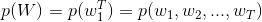</a></div>

  根据贝叶斯公式，有
  <div align="center"><a href="http://www.codecogs.com/eqnedit.php?latex=p(w_1^T)=p(w_1)\cdot&space;p(w_2|w_1)\cdot&space;p(w_3|w_1^2)\cdots&space;p(w_T|w_1^{T-1})">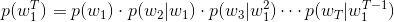</a></div>

- 其中每个条件概率就是**模型的参数**；如果这个参数都是已知的，那么就能得到整个序列的概率了

### 参数的规模
- 设词表的大小为 `N`，考虑长度为 `T` 的句子，理论上有 `N^T` 种可能的句子，每个句子中有 `T` 个参数，那么参数的数量将达到 `O(T*N^T)`

### 可用的概率模型
- 统计语言模型实际上是一个概率模型，所以常见的概率模型都可以用于求解这些参数
- 常见的概率模型有：N-gram 模型、决策树、最大熵模型、隐马尔可夫模型、条件随机场、神经网络等
- 目前常用于语言模型的是 N-gram 模型和神经语言模型（下面介绍）


## N-gram 语言模型
- 马尔可夫(Markov)假设——未来的事件，只取决于有限的历史
- 基于马尔可夫假设，N-gram 语言模型认为一个词出现的概率只与它前面的 n-1 个词相关
  <div align="center"><a href="http://www.codecogs.com/eqnedit.php?latex=p(w_k|w_1,..,w_{k-1})\approx&space;p(w_k|w_{k-n&plus;1},..,w_{k-1})">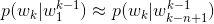</a></div>
  
- 根据**条件概率公式**与**大数定律**，当语料的规模足够大时，有
  <div align="center"><a href="http://www.codecogs.com/eqnedit.php?latex=p(w_k|w_{k-n&plus;1}^{k-1})=\frac{p(w_{k-n&plus;1}^k)}{p(w_{k-n&plus;1}^{k-1})}\approx&space;\frac{\mathrm{count}(w_{k-n&plus;1}^k)}{\mathrm{count}(w_{k-n&plus;1}^{k-1})}"></a></div>

- 以 `n=2` 即 bi-gram 为例，有
  <div align="center"><a href="http://www.codecogs.com/eqnedit.php?latex=p(w_k|w_{k-1})=\frac{p(w_{k-1},w_k)}{p(w_{k-1})}\approx&space;\frac{\mathrm{count}(w_{k-1},w_k)}{\mathrm{count}(w_{k-1})}">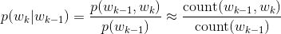</a></div>

- 假设词表的规模 `N=200000`（汉语的词汇量），模型参数与 `n· 的关系表
  <div align="center"><a href="">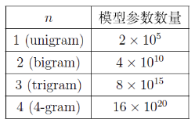</a></div>

### 可靠性与可区别性
- 假设没有计算和存储限制，`n` 是不是越大越好？
- 早期因为计算性能的限制，一般最大取到 `n=4`；如今，即使 `n>10` 也没有问题，
- 但是，随着 `n` 的增大，模型的性能增大却不显著，这里涉及了**可靠性与可区别性**的问题
- 参数越多，模型的可区别性越好，但是可靠性却在下降——因为语料的规模是有限的，导致 `count(W)` 的实例数量不够，从而降低了可靠性

### OOV 问题
- OOV 即 Out Of Vocabulary，也就是序列中出现了词表外词，或称为**未登录词**
- 或者说在测试集和验证集上出现了训练集中没有过的词
- 一般**解决方案**：
  - 设置一个词频阈值，只有高于该阈值的词才会加入词表
  - 所有低于阈值的词替换为 UNK（一个特殊符号）
- 无论是统计语言模型还是神经语言模型都是类似的处理方式
  > [NPLM 中的 OOV 问题](#nplm-中的-oov-问题)

### 平滑处理 TODO
- `count(W) = 0` 是怎么办？ 
- 平滑方法（层层递进）：
  - Add-one Smoothing (Laplace)
  - Add-k Smoothing (k<1)
  - Back-off （回退）
  - Interpolation （插值法）
  - Absolute Discounting （绝对折扣法）
  - Kneser-Ney Smoothing （KN）
  - Modified Kneser-Ney
  > [自然语言处理中N-Gram模型的Smoothing算法](https://blog.csdn.net/baimafujinji/article/details/51297802) - CSDN博客 


## 神经概率语言模型 (NPLM)
> [专题-词向量](./专题-词向量.md)
- 神经概率语言模型依然是一个概率语言模型，它通过**神经网络**来计算概率语言模型中每个参数
  <div align="center"><a href="http://www.codecogs.com/eqnedit.php?latex=p(w|{\color{Red}\text{context}(w)})=g(i_w,{\color{Red}V_{context}})"></a></div>
  
  - 其中 `g` 表示神经网络，`i_w` 为 `w` 在词表中的序号，`context(w)` 为 `w` 的上下文，`V_context` 为上下文构成的特征向量。
  - `V_context` 由上下文的**词向量**进一步组合而成

### N-gram 神经语言模型
> [A Neural Probabilistic Language Model](http://www.jmlr.org/papers/volume3/bengio03a/bengio03a.pdf) (Bengio, et al., 2003)
- 这是一个经典的神经概率语言模型，它沿用了 N-gram 模型中的思路，将 `w` 的前 `n-1` 个词作为 `w` 的上下文 `context(w)`，而 `V_context` 由这 `n-1` 个词的词向量拼接而成，即
  <div align="center"><a href="http://www.codecogs.com/eqnedit.php?latex=p(w_k|{\color{Red}w_{k-n&plus;1}^{k-1}})=g(i_{w_k},{\color{Red}[c(w_{k-n&plus;1});...;c(w_{k-1})]})">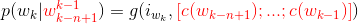</a></div>

  - 其中 `c(w)` 表示 `w` 的词向量
  - 不同的神经语言模型中 `context(w)` 可能不同，比如 Word2Vec 中的 CBOW 模型
- 每个训练样本是形如 `(context(w), w)` 的二元对，其中 `context(w)` 取 w 的前 `n-1` 个词；当不足 `n-1`，用特殊符号填充
  - 同一个网络只能训练特定的 `n`，不同的 `n` 需要训练不同的神经网络

#### N-gram 神经语言模型的网络结构
  - 【**输入层**】首先，将 `context(w)` 中的每个词映射为一个长为 `m` 的词向量，**词向量在训练开始时是随机的**，并**参与训练**；
  - 【**投影层**】将所有上下文词向量**拼接**为一个长向量，作为 `w` 的特征向量，该向量的维度为 `m(n-1)`
  - 【**隐藏层**】拼接后的向量会经过一个规模为 `h` 隐藏层，该隐层使用的激活函数为 `tanh`
  - 【**输出层**】最后会经过一个规模为 `N` 的 Softmax 输出层，从而得到词表中每个词作为下一个词的概率分布
    > 其中 `m, n, h` 为超参数，`N` 为词表大小，视训练集规模而定，也可以人为设置阈值
  - 训练时，使用**交叉熵**作为损失函数
  - **当训练完成时**，就得到了 N-gram 神经语言模型，以及副产品**词向量**
  - 整个模型可以概括为如下公式：
    <div align="center"><a href="http://www.codecogs.com/eqnedit.php?latex=y=U\cdot\tanh(Wx&plus;p)&plus;q"></a></div><br/>
    <div align="center"><a href=""></a></div>
  
  > 原文的模型还考虑了投影层与输出层有有边相连的情形，因而会多一个权重矩阵，但本质上是一致的：
  >> <div align="center"><a href="http://www.codecogs.com/eqnedit.php?latex=y=U\cdot\tanh(W_1x&plus;p)&plus;W_2x&plus;q">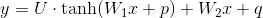</a></div><br/>
  >> <div align="center"><a href="">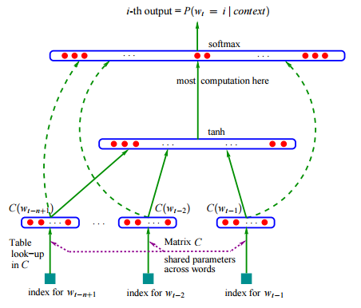</a></div>

### 模型参数的规模与运算量
- 模型的超参数：`m, n, h, N`
  - `m` 为词向量的维度，通常在 `10^1 ~ 10^2`
  - `n` 为 n-gram 的规模，一般小于 5
  - `h` 为隐藏的单元数，一般在 `10^2`
  - `N` 位词表的数量，一般在 `10^4 ~ 10^5`，甚至 `10^6`
- 网络参数包括两部分
  - 词向量 `C`: 一个 `N * m` 的矩阵——其中 `N` 为词表大小，`m` 为词向量的维度 
  - 网络参数 `W, U, p, q`：
    ```
    - W: h * m(n-1) 的矩阵
    - p: h * 1      的矩阵
    - U: N * h    的矩阵
    - q: N * 1    的矩阵
    ```
- 模型的运算量
  - 主要集中在隐藏层和输出层的矩阵运算以及 SoftMax 的归一化计算
  - 此后的相关研究中，主要是针对这一部分进行优化，其中就包括 **Word2Vec** 的工作

### 相比 N-gram 模型，NPLM 的优势
- 单词之间的相似性可以通过词向量来体现
  > 相比神经语言模型本身，作为其副产品的词向量反而是更大的惊喜
  >
  > [词向量的理解](./专题-词向量.md#词向量的理解)
- 自带平滑处理

### NPLM 中的 OOV 问题
- 在处理语料阶段，与 N-gram 中的处理方式是一样的——将不满阈值的词全部替换为 UNK
**神经网络**中，一般有如下几种处理 UNK 的思路
- 为 UNK 分配一个随机初始化的 embedding，并**参与训练**
  > 最终得到的 embedding 会有一定的语义信息，但具体好坏未知
- 把 UNK 都初始化成 0 向量，**不参与训练**
  > UNK 共享相同的语义信息
- 每次都把 UNK 初始化成一个新的随机向量，**不参与训练**
  > 常用的方法——因为本身每个 UNK 都不同，随机更符合对 UNK 基于最大熵的估计
  >> [How to add new embeddings for unknown words in Tensorflow (training & pre-set for testing)](https://stackoverflow.com/questions/45113130/how-to-add-new-embeddings-for-unknown-words-in-tensorflow-training-pre-set-fo) - Stack Overflow
  >>
  >> [Initializing Out of Vocabulary (OOV) tokens](https://stackoverflow.com/questions/45495190/initializing-out-of-vocabulary-oov-tokens) - Stack Overflow
- 基于 Char-Level 的方法
  > PaperWeekly 第七期 -- [基于Char-level的NMT OOV解决方案](https://zhuanlan.zhihu.com/p/22700538?refer=paperweekly) 

# 文本匹配

# 阅读理解/问答

## self-attention 实现机制


## Reference
- [近期有哪些值得读的QA论文？](https://www.jiqizhixin.com/articles/2018-06-11-14)| 专题论文解读 | 机器之心 

# NLP 实践
## seq2seq 中 scheduled sampling 怎么做

## RL 中的 reward 机制

## Action 怎么实现的

## NLP 怎么做数据增强
- 利用 NMT 做双向翻译——将语言A 翻译到其他语言，再翻译回语言 A

  这个过程相当于对样本进行了改写，使得训练样本的数量大大增加
- QANet 中的做法：
  <div align="center"></div>

  - 对材料中每个句子通过翻译引擎得到`k`句法语候选，然后将每句法语转回英语，得到`k^2`个改写的句子，从中随机选择一句作为

  - 改写后答案的位置也可能改变，如何寻找**新答案的位置**？

    具体到 SQuAD 任务就是 (d,q,a) -> (d’, q, a’)，问题不变，对文档 d 翻译改写，由于改写后原始答案 a 现在可能已经不在改写后的段落 d’ 里了，所以需要从改写后的段落 d’ 里抽取新的答案 a’，采用的方法是计算 d’ 里每个单词和原始答案里 start/end words 之间的 **character-level 2-gram score**，分数最高的单词就被选择为新答案 a’ 的 start/end word。
    > 中文没有里面没有 character-level 2-gram，可以考虑词向量之间的相似度


# 预备知识
## 评价机制

### 困惑度 (Perplexity, PPX)
> [Perplexity](https://en.wikipedia.org/wiki/Perplexity) - Wikipedia
- 在信息论中，perplexity 用于度量一个**概率分布**或**概率模型**预测样本的好坏程度
  > 机器学习/[信息论](../机器学习/README.md#信息论) 

<h3>基本公式</h3>

- **概率分布**（离散）的困惑度
  <div align="center"><a href="http://www.codecogs.com/eqnedit.php?latex=\dpi{150}&space;{\displaystyle&space;2^{H(p)}=2^{-\sum&space;_{x}p(x)\log&space;_{2}p(x)}}">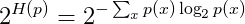</a></div>
  
  > 其中 `H(p)` 即**信息熵**

- **概率模型**的困惑度
  <div align="center"><a href="http://www.codecogs.com/eqnedit.php?latex=\dpi{150}&space;{\displaystyle&space;b^{-{\frac&space;{1}{N}}\sum&space;_{i=1}^{N}\log&space;_{b}q(x_{i})}}"></a></div>

  > 通常 `b=2`
  
- **指数部分**也可以是**交叉熵**的形式，此时困惑度相当于交叉熵的指数形式
  <div align="center"><a href="http://www.codecogs.com/eqnedit.php?latex=\dpi{150}&space;2^{H(\tilde{p},q)}&space;=&space;2^{-\sum_x\tilde{p}(x)\log_{2}q(x)}"></a></div>

  > 其中 `p~` 为**测试集**中的经验分布——`p~(x) = n/N`，其中 `n` 为 x 的出现次数，N 为测试集的大小

**语言模型中的 PPX**
- 在 **NLP** 中，困惑度常作为**语言模型**的评价指标
  <div align="center"><a href="http://www.codecogs.com/eqnedit.php?latex=\dpi{150}&space;\begin{aligned}&space;\mathrm{PPX}(W_{test})&space;&=2^{-\sum_{i=1}^{|V|}\tilde{p}(w_i)\log_{2}q(w_i)}\\&space;&=2^{-\sum_{i=1}^{|V|}\frac{\mathrm{cnt}(w_i)}{N}\log_{2}q(w_i)}&space;\end{aligned}"></a></div>

- 直观来说，就是下一个**候选词数目**的期望值——

  如果不使用任何模型，那么下一个候选词的数量就是整个词表的数量；通过使用 `bi-gram`语言模型，可以将整个数量限制到 `200` 左右

### BLEU
> [一种机器翻译的评价准则——BLEU](https://blog.csdn.net/qq_21190081/article/details/53115580) - CSDN博客 
- 机器翻译评价准则
- 计算公式
  <div align="center">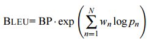</div>

  其中
  <div style="position:relative;left:25%"></div>
  <div style="position:relative;left:25%">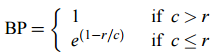</div>
  <!-- <div style="position:relative;left:25%"></div> -->

  > `c` 为生成句子的长度；`r` 为参考句子的长度——目的是**惩罚**长度过短的候选句子

- 为了计算方便，会加一层 `log` 
  <div align="center">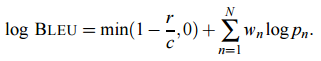</div>
  
  > 通常 `N=4, w_n=1/4`

### ROUGE
> [自动文摘评测方法：Rouge-1、Rouge-2、Rouge-L、Rouge-S](https://blog.csdn.net/qq_25222361/article/details/78694617) - CSDN博客 
- 一种机器翻译/自动摘要的评价准则

> [BLEU，ROUGE，METEOR，ROUGE-浅述自然语言处理机器翻译常用评价度量](https://blog.csdn.net/joshuaxx316/article/details/58696552) - CSDN博客 

