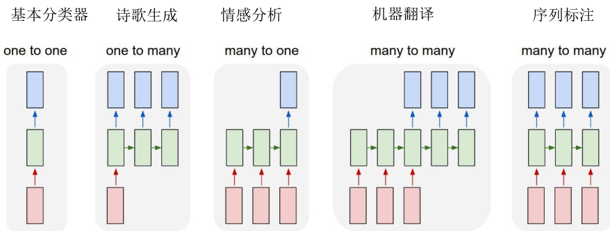
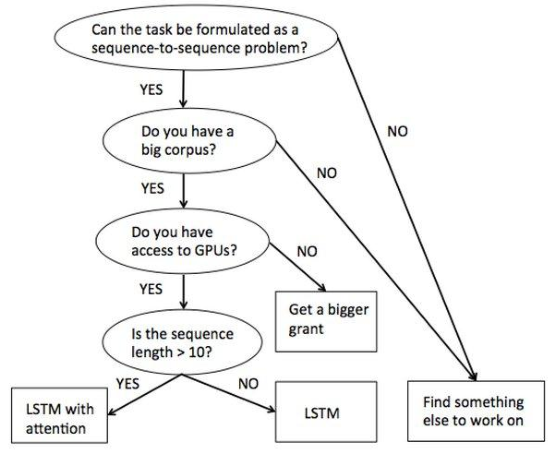

专题-序列建模
===

Reference
---
- 自然语言处理之序列模型 - 小象学院

Index
---
<!-- TOC -->

- [NLP 概述](#nlp-概述)
  - [解决 NLP 问题的一般思路](#解决-nlp-问题的一般思路)
  - [NLP 的历史进程](#nlp-的历史进程)
  - [Seq2Seq 模型](#seq2seq-模型)
- [序列建模](#序列建模)
  - [RNN TODO](#rnn-todo)
  - [LSTM TODO](#lstm-todo)

<!-- /TOC -->

# NLP 概述

## 解决 NLP 问题的一般思路
```tex
这个问题人类可以做好么？
  - 可以 -> 记录自己的思路 -> 设计流程让机器完成你的思路
  - 很难 -> 尝试从计算机的角度来思考问题
```

## NLP 的历史进程
- **规则系统**
  - 正则表达式/自动机
  - 规则是固定的
  - **搜索引擎**
    ```tex
    “豆瓣酱用英语怎么说？”
    规则：“xx用英语怎么说？” => translate(XX, English)
    
    “我饿了”
    规则：“我饿（死）了” => recommend(饭店，地点)
    ```
- **概率系统**
  - 规则从数据中**抽取**
  - 规则是有**概率**的
  - 概率系统的一般**工作方式**
    ```tex
    流程设计
      收集训练数据
        预处理
          特征工程
            分类器（机器学习算法）
              预测
                评价
    ```
    <div align="center"></div>
    
    - 最重要的部分：数据收集、预处理、特征工程
  - 示例
    ```tex
    任务：
      “豆瓣酱用英语怎么说” => translate(豆瓣酱，Eng)

    流程设计（序列标注）：
      子任务1： 找出目标语言 “豆瓣酱用 **英语** 怎么说”
      子任务2： 找出翻译目标 “ **豆瓣酱** 用英语怎么说”

    收集训练数据：
      （子任务1）
      “豆瓣酱用英语怎么说”
      “茄子用英语怎么说”
      “黄瓜怎么翻译成英语”
    
    预处理：
      分词：“豆瓣酱 用 英语 怎么说”

    抽取特征：
      （前后各一个词）
      0 茄子：    < _ 用
      0 用：      豆瓣酱 _ 英语
      1 英语：    用 _ 怎么说
      0 怎么说：  英语 _ >

    分类器：
      SVM/CRF/HMM/RNN

    预测：
      0.1 茄子：    < _ 用
      0.1 用：      豆瓣酱 _ 英语
      0.7 英语：    用 _ 怎么说
      0.1 怎么说：  英语 _ >

    评价：
      准确率
    ```
- 概率系统的优/缺点
  - `+` 规则更加贴近于真实事件中的规则，因而效果往往比较好
  - `-` 特征是由专家/人指定的；
  - `-` 流程是由专家/人设计的；
  - `-` 存在独立的**子任务**

- **深度学习**
  - 深度学习相对概率模型的优势
    - 特征是由专家指定的 `->` 特征是由深度学习自己提取的
    - 流程是由专家设计的 `->` 模型结构是由专家设计的
    - 存在独立的子任务 `->` End-to-End Training

## Seq2Seq 模型
- 大部分自然语言问题都可以使用 Seq2Seq 模型解决
  <div align="center"></div>

- **“万物”皆 Seq2Seq**
  <div align="center"></div>


# 序列建模
- 序列建模的目的在于学习一个模型，从而能对观测序列给出标记序列作为预测，即最大化概率 P（y_1，y_2，...，y_n | x_1，x_2，...，x_n）

## RNN TODO

## LSTM TODO