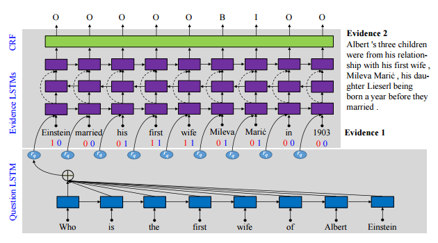
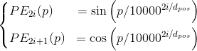

**RoadMap**
---
<!-- TOC -->

- [微博用户画像](#微博用户画像)
  - [任务描述](#任务描述)
  - [思路](#思路)
  - [数据预处理](#数据预处理)
  - [特征工程](#特征工程)
  - [模型](#模型)
- [讯飞中文阅读理解评测](#讯飞中文阅读理解评测)
  - [任务说明](#任务说明)
  - [思路](#思路-1)
  - [模型](#模型-1)
    - [Encoder 部分](#encoder-部分)
    - [Decoder 部分](#decoder-部分)
- [CIPS-SOGOU 事实类问答评测](#cips-sogou-事实类问答评测)
  - [任务描述](#任务描述-1)
  - [思路](#思路-2)
  - [模型](#模型-2)
    - [Encoder](#encoder)
    - [Decoder](#decoder)
    - [损失函数](#损失函数)
    - [如何构造位置向量](#如何构造位置向量)
    - [匹配模型中常用的共现特征 TODO](#匹配模型中常用的共现特征-todo)
    - [其他 TODO](#其他-todo)

<!-- /TOC -->

# 微博用户画像
> [2017.4-5]; 自然语言处理课程项目
>
> 本来是上届师兄参加的比赛——SMP CUP微博用户画像大赛，这次作为我们 NLP 课程的项目

## 任务描述
- 利用给定的新浪微博数据（包括用户个人信息、用户微博文本以及用户粉丝列表，详见数据描述部分），进行微博用户画像，具体包括以下三个任务：
  - 任务1：推断用户的年龄（共3个标签：-1979/1980-1989/1990+）
  - 任务2：推断用户的性别（共2个标签：男/女）
  - 任务3：推断用户的地域（共8个标签：东北/华北/华中/华东/西北/西南/华南/境外）

## 思路
- 形式上是一个多分类问题，**特征工程**是关键
> 当时刚刚接触机器学习，没有这个意识，大部分时间都用来熟悉模型了

## 数据预处理
- **停用词**处理
  - 对词频排序，手动筛选停用词
  <!-- - 只处理最基础的标点和特殊符号，尽量保留词信息 -->
- 对未分词数据用 jieba **分词**
  - 关闭“新词发现”
  - 扩充词典（网络收集，微博语料新词发现+人工筛选）
- 提取**表情符**
  - 默认系列：`[微笑]`等
- **缺失值**处理
  - 根据缺失数据的比例决定填充还是丢弃
- 构建**地域映射表**（任务3）

## 特征工程
- 基本特征
  - 粉丝数量，微博数量，发布平台（来源），发布时间段（离散化），...
- 统计特征
  - 平均每条微博的评论/转发人数，
  - 最大/最小的评论/转发数，
  - 博文中出现的地区数量，
  - 每个时间段的发帖量（每小时，早中晚），...
- **交叉特征**/特征组合
  - 特征组合的种类
    - `[A x A]` —— 对单个特征的值求平方形成的组合特征。
    - `[A X B]` —— 将两个特征的值相乘形成的组合特征。
    - `[A x B x C x ...]` —— 将多个特征的值相乘形成的组合特征。
  - 组合 Ont-Hot 编码
    - 组合两个 `1*3` 的编码可以得到一个 `1*9` 的编码
    - 比如组合**发帖时间**和**发布平台**
    
      `[早, 中, 晚]` x `[手机, 电脑, 平板]` -> `[早+手机, 中+手机, 晚+手机, 早+电脑, ...]`
- 词向量 word2vec
  - [词向量维数的选择](#embedding-维度的选择)

**特征选择**
- 使用 XGBoost 进行特征选择
  ```Python
  params = {...}
  xgtrain = xgb.DMatrix(X, label=y)
  bst = xgb.train(params, xgtrain)
  importance = bst.get_fscore()
  importance = sorted(importance.items(), key=lambda x: x[1])
  importance_df = pd.DataFrame(importance, columns=['feature', 'fscore'])
  importance_df.plot(kind='barh', x='feature', y='fscore')
  ```

## 模型
- **SVM** (baseline)
  > ../机器学习#[支持向量机](../机器学习-深度学习-NLP/ML-机器学习算法.md#支持向量机)
- **GBDT**(XGBoost库)
  > ../机器学习#[GBDT](../机器学习-深度学习-NLP/README.md#梯度提升决策树-gbdt) & #[XGBoost](../ML-机器学习算法.md#xgboost-算法)


# 讯飞中文阅读理解评测
> [2017.7-9]; [第一届“讯飞杯”中文机器阅读理解评测 - CMRC 2017](http://www.hfl-tek.com/cmrc2017)
- 由哈工大与讯飞联合举办的第一届“讯飞杯”中文机器阅读理解评测
- 数据集和任务格式是哈工大去年提出的。
  工大去年的论文[`[1607.02250]`](https://arxiv.org/abs/1607.02250)研究了另一个相同形式的数据集。

## 任务说明
> [任务介绍 - CMRC 2017](http://www.hfl-tek.com/cmrc2017/task/)
- 以**单个词**为答案的填空类问题、用户提问类问题。答案会在上下文中出现。
  > 只做了填空类问题

- 数据格式
  ```
  篇章：由若干个连续的句子组成的一个文本段落，但文中缺少某一个词，标记为 XXXXX
  问题：缺少的词 XXXXX 所在的句子
  答案：缺少的词 XXXXX
  ```

- 示例
  - 填空类问题
    ```
    1 ||| 工商 协进会 报告 ， 12月 消费者 信心 上升 到 78.1 ， 明显 高于 11月 的 72 。
    2 ||| 另 据 《 华尔街 日报 》 报道 ， 2013年 是 1995年 以来 美国 股市 表现 最 好 的 一 年 。
    3 ||| 这 一 年 里 ， 投资 美国 股市 的 明智 做法 是 追 着 “ 傻钱 ” 跑 。
    4 ||| 所谓 的 “ 傻钱 ” XXXXX ， 其实 就 是 买 入 并 持有 美国 股票 这样 的 普通 组合 。
    5 ||| 这个 策略 要 比 对冲 基金 和 其它 专业 投资者 使用 的 更为 复杂 的 投资 方法 效果 好 得 多 。
    <qid_1> ||| 所谓 的 “ 傻钱 ” XXXXX ， 其实 就 是 买 入 并 持有 美国 股票 这样 的 普通 组合 。
    ```
    答案
    ```
    <qid_1> ||| 策略
    ```
  - 提问类问题
    ```
    1 ||| 工商 协进会 报告 ， 12月 消费者 信心 上升 到 78.1 ， 明显 高于 11月 的 72 。
    2 ||| 另 据 《 华尔街 日报 》 报道 ， 2013年 是 1995年 以来 美国 股市 表现 最 好 的 一 年 。
    3 ||| 这 一 年 里 ， 投资 美国 股市 的 明智 做法 是 追 着 “ 傻钱 ” 跑 。
    4 ||| 所谓 的 “ 傻钱 ” 策略 ， 其实 就 是 买 入 并 持有 美国 股票 这样 的 普通 组合 。
    5 ||| 这个 策略 要 比 对冲 基金 和 其它 专业 投资者 使用 的 更为 复杂 的 投资 方法 效果 好 得 多 。
    <qid_1> ||| 哪 一 年 是 美国 股市 表现 最 好 的 一 年 ？
    ```
    答案
    ```
    <qid_1> ||| 2013年
    ```

## 思路
- 类似语言模型的思路：
  - 语言模型是根据前 n 个词从整个词表中预测下一个词；
  - 这里是根据上下文并从中挑选正确的答案
- 可以采用 **encoder-decoder 框架**，这里相当于 "seq2word"
- 对语言建模来说，LSTM 的效果更好；
  - 为了更好的获取全局的语义信息，可以使用多层 bi-LSTM 对上下文进行编码；

## 模型

### Encoder 部分
- Encoder 部分是一个**2 层 bi-LSTM**；因为语料不大，所以层数不多
  > TODO: [LSTM](../深度学习/RNN.md#lstm)
- 以答案断开材料，分为上文和下文；两者共享同一个 Encoder，即**参数共享**
  > 为什么共享参数？——模拟人在做完形填空的过程，上下文会共同影响结果。
- 拼接 bi-LSTM 的两段输出向量得到上下文各自的特征向量；然后对上下文的特征向量求平均作为**全局特征**。

### Decoder 部分
- 为了实现在上下文中搜索目标词，而不是在整个词表中：

  控制 Encoder 的输出向量，即全局特征，与词向量的**维度相同**，然后计算其与段落中的每个词的 **cos 距离**（即内积），然后通过 softmax 得到所有词的**概率分布**。
<!-- - 除了与词向量做内积，还可以使用 LSTM 的状态向量，实验中也有类似的效果，甚至更好（原因未知） -->

<!-- TODO: 模型图示 -->

<h3>实现细节</h3>

- 原材料已经经过分句和分词处理，实际只是用了**分词**信息。
- 因为每个词有可能多次出现，所以需要对所有相同词的概率求和作为该词的概率。
- 未登录词的处理：所有未登录词会映射到同一个词向量，并开放训练
- 其他词向量在前 n 轮不参与训练，在 n 轮后会加入微调


# CIPS-SOGOU 事实类问答评测
> [2017.10-2018.1]; [CIPS-SOGOU问答比赛](http://task.www.sogou.com/cips-sogou_qa/)
- CIPS-SOGOU问答比赛是由中国中文信息学会（CIPS）和搜狗搜索（SOGOU SEARCH）联合主办的一项开放域的智能问答评测比赛。

## 任务描述
- 针对每个问题 q，给定与之对应的若干候选答案篇章 a1，a2，…，an，要求设计算法从候选篇章中**抽取合适的词语、短语或句子**，形成一段正确、完整、简洁的文本，作为预测答案 apred，目标是 apred 能够正确、完整、简洁地回答问题 q。
- 示例
  ```
  问题: 中国最大的内陆盆地是哪个
  答案：塔里木盆地
  材料：
    1. 中国新疆的塔里木盆地，是世界上最大的内陆盆地，东西长约1500公里，南北最宽处约600公里。盆地底部海拔1000米左右，面积53万平方公里。
    2. 中国最大的固定、半固定沙漠天山与昆仑山之间又有塔里木盆地，面积53万平方公里，是世界最大的内陆盆地。盆地中部是塔克拉玛干大沙漠，面积33.7万平方公里，为世界第二大流动性沙漠。
  ```

## 思路
- 参考模型：BiDAF https://allenai.github.io/bi-att-flow/
- 参考论文：[[1607.06275]](https://arxiv.org/abs/1607.06275)——百度利用百度知道等资源构建一个 WebQA 数据集，数据形式与本次评测基本一致；

  论文使用的模型如下：
  <div align="center"></div>

<h3>结构说明</h3>

- 编码部分
  - 首先，使用 LSTM **对问题编码**，得到问题的**特征向量** `rq`（LSTM + Attention）；
  - 然后将**问题的特征向量**、**材料的词向量**以及其他可选的**人工特征**（词的**共现特征**）构成新的输入，通过一个多层 LSTM 编码器，得到新的组合特征。
- 解码部分
  - 解码部分使用的是 CRF（条件随机场），相当于将寻找答案的过程当做一个**序列标注**问题。
  - 最终得到答案的位置——`B, I, O` 分别表示 Begin、Inside、Outside 答案。
- 值得一提的是，论文用到了两个**共现特征**—— `Question-Evidence common word feature` 和 `Evidence-Evidence common word feature`
  - 前者表示每个材料中的词是否在问题中出现，后者表示在该材料中出现的词是否在其他材料中出现。
  - 前者出于这一**直觉**——在问题中出现的词往往不是答案的一部分；后者则相反，在不同材料中多次出现的词很可能是答案的一部分。

## 模型
- 模型的结构与 WebQA 基本相同：分为 Encoder 和 Decoder 部分
- 但是 Encoder 部分使用的是 CNN，而不是 LSTM
  > [为什么使用 CNN 代替 RNN](../深度学习/CNN.md#为什么使用-cnn-代替-rnn)
  
### Encoder
- 首先使用 CNN 对问题编码得到问题向量，具体使用了“**空洞卷积**”与“**门卷积**”（卷积+**门限单元**）
  > [空洞卷积](../深度学习/CNN.md#空洞卷积) | [门卷积](../深度学习/CNN.md#门卷积)
- 然后将得到的问题向量**拼接**到材料的**每一个词向量**之后
- 为了保留词的顺序信息，加入每个词的**位置向量**（Position Embedding）
  > [如何构造位置向量](#如何构造位置向量) - “Attention is All you Need”
- 最后添加人工提取的共现特征（`Q` 表示问题 Question问题，`E` 表示材料 Evidence）
  - `Q - E` 匹配——表示每个材料中的词是否在问题中出现，出现为 `1`，否则为 `0`
  - `E - E` 匹配——表示每个材料中的词是否在其他材料中出现。与 WebQA 中略有不同的是，因为有多段材料，实际使用的是`含有该词的材料数/总的材料数`。而不是 `0/1` 值。
  
    **注意**：无论在其他材料中出现几次，都只计 1 次，以防一些**停用词**获得过高的权重。
  - **字符级**共现特征——以上两个特征都是以**词**为单位的，同时还可以以字为单位，然后将字的特征做平均作为词的特征。

    **示例**：比如问题中出现了“表演者”，材料中为“演员”，如果以“词”为标准，两者的共现关系的为 `0`；如果以“字符”为单位，那么“演员”可以提供 `0.5` 的 `Q - E` 匹配特征。
  - Jaccard相似度、相对编辑距离等
    > https://kexue.fm/archives/5409#Q-E软匹配
  > [匹配模型中常用的共现特征](#匹配模型中常用的共现特征)

### Decoder
- Docoder 部分参考了由百度 PointerNet，使用**双指针**输出来标注答案的位置
  - 解码部分是一个多层 bi-LSTM，该网络使用**问题特征**来初始化参数
  - 然后使用该编码器对材料特征进行解码
  - 最后对整个序列对两次 **Softmax** 来预测答案的首尾位置。
  > [DuReader/pointer_net.py](https://github.com/baidu/DuReader/blob/master/tensorflow/layers/pointer_net.py) at master · baidu/DuReader 

<!-- TODO: 加入模型图示 -->

### 损失函数
**损失函数由多部分组成**
- 首先是位置损失，包括首指针的位置和尾指针的位置；
- 其次是材料损失，指示该段材料中是否存在答案，该损失的权重要高于位置损失；
- 最后加上 L2 正则化项。

### 如何构造位置向量
> "Attention is All you Need" 
- 公式
  <div align="center"><a href="http://www.codecogs.com/eqnedit.php?latex=Gain&space;=&space;\frac{1}{2}&space;\left[\frac{G_L^2}{H_L&plus;\lambda}&plus;\frac{G_R^2}{H_R&plus;\lambda}-\frac{(G_L&plus;G_R)^2}{H_L&plus;H_R&plus;\lambda}\right]&space;-&space;\gamma"></a></div>

  > 注意：无论奇偶，指数部分都是 `2i/d_pos`

- **Python 代码**
  ```Python
  n_pos = 3  # 序列长度
  d_pos = 5  # 向量维度

  pos_vec = []
  for pos in range(n_pos):
      pos_embed = []
      for i in range(d_pos):
          if i % 2 == 0:
              pos_embed.append(math.sin(pos / pow(10000, (i-i%2) / d_pos)))  # (i-i%2) == 2*(i//2)
          else:
              pos_embed.append(math.cos(pos / pow(10000, (i-i%2) / d_pos)))
      pos_vec.append(pos_embed)

  # [[0.0, 1.0, 0.0, 1.0, 0.0],
  #  [0.84147, 0.5403,  0.02512, 0.99968, 0.00063],
  #  [0.9093, -0.41615, 0.05022, 0.99874, 0.00126]]
  ```
- **矢量化**代码
  ```Python
  pos_vec = np.array([
      [pos / np.power(10000, (i-i%2) / d_pos) for i in range(d_pos)]  # (i-i%2) == 2*(i//2)
      for pos in range(n_pos)
  ])

  pos_vec[:, 0::2] = np.sin(pos_vec[:, 0::2])  # dim 2i
  pos_vec[:, 1::2] = np.cos(pos_vec[:, 1::2])  # dim 2i+1
  ```

### 匹配模型中常用的共现特征 TODO

### 其他 TODO
- 分词使用 jieba 库，关闭新词发现，手动将所有单词和数字拆分为单个字符


